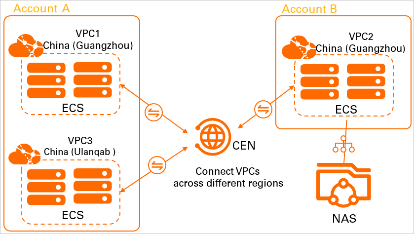

# Alibaba Cloud File Storage in Microservices


_[Jesse Veldmaat, oktober 2024.](https://github.com/hanaim-devops/blog-student-naam)_

<hr/>

## Inhoudsopgave

- [Alibaba Cloud File Storage in Microservices](#alibaba-cloud-file-storage-in-microservices)
  - [Inhoudsopgave](#inhoudsopgave)
  - [Het toepassen van Alibaba Cloud File Storage in een self-managed microservices-architectuur](#het-toepassen-van-alibaba-cloud-file-storage-in-een-self-managed-microservices-architectuur)
    - [Wat zijn de belangrijkste kenmerken en mogelijkheden van Alibaba Cloud File Storage?](#wat-zijn-de-belangrijkste-kenmerken-en-mogelijkheden-van-alibaba-cloud-file-storage)
      - [Belangrijkste kenmerken:](#belangrijkste-kenmerken)
    - [Welke voordelen biedt Alibaba Cloud File Storage ten opzichte van traditionele file storage?](#welke-voordelen-biedt-alibaba-cloud-file-storage-ten-opzichte-van-traditionele-file-storage)
    - [Welke best practices zijn er voor het gebruik van Alibaba Cloud File Storage in een microservices-architectuur?](#welke-best-practices-zijn-er-voor-het-gebruik-van-alibaba-cloud-file-storage-in-een-microservices-architectuur)
    - [Hoe kan Alibaba Cloud File Storage worden geïntegreerd in een al bestaande self-managed microservices-architectuur?](#hoe-kan-alibaba-cloud-file-storage-worden-geïntegreerd-in-een-al-bestaande-self-managed-microservices-architectuur)
      - [Stap 1: Maak een RAM-gebruiker aan](#stap-1-maak-een-ram-gebruiker-aan)
      - [Stap 2: Koppel de policy aan de RAM-gebruiker](#stap-2-koppel-de-policy-aan-de-ram-gebruiker)
      - [Stap 3: Maak een secret aan in Kubernetes](#stap-3-maak-een-secret-aan-in-kubernetes)
      - [Stap 4: Installeer de CSI-plug-in](#stap-4-installeer-de-csi-plug-in)
      - [Stap 5: Configureer Persistent Volumes en Claims](#stap-5-configureer-persistent-volumes-en-claims)
      - [Stap 6: Voeg de opslag toe aan je Pods](#stap-6-voeg-de-opslag-toe-aan-je-pods)
    - [Conclusie](#conclusie)
  - [Bronnen](#bronnen)

## Het toepassen van Alibaba Cloud File Storage in een self-managed microservices-architectuur

Voor dit onderzoek is gekeken naar hoe je Alibaba Cloud File Storage kunt toepassen in een self-managed microservices-architectuur. Hierbij hebben we gekeken naar de belangrijkste kenmerken en mogelijkheden van Alibaba Cloud File Storage, de voordelen ten opzichte van traditionele file storage, best practices voor het gebruik van Alibaba Cloud File Storage in een microservices-architectuur, en hoe je Alibaba Cloud File Storage kunt integreren in een al bestaande self-managed microservices-architectuur.

In de wereld van moderne softwareontwikkeling spelen cloud-native applicaties en microservices-architecturen een cruciale rol. Bedrijven verplaatsen hun infrastructuur steeds meer naar de cloud vanwege de flexibiliteit, schaalbaarheid en kostenefficiëntie. Een belangrijk aspect van deze transformatie is bestandsopslag: hoe beheer je grote hoeveelheden data die toegankelijk moeten zijn voor meerdere services, verspreid over verschillende omgevingen?

Hier komt Alibaba Cloud File Storage in beeld. Als een van de belangrijkste producten van Alibaba Cloud, biedt het een robuuste oplossing voor bedrijven die op zoek zijn naar schaalbare en betrouwbare opslag in hun microservices-architectuur. In deze blog verkennen we hoe je Alibaba Cloud File Storage kunt toepassen binnen een microservices-architectuur, en bekijken we de voordelen, best practices, en de integratiemogelijkheden.

### Wat zijn de belangrijkste kenmerken en mogelijkheden van Alibaba Cloud File Storage?

Alibaba Cloud File Storage, ook wel bekend als Alibaba Cloud NAS (Network Attached Storage), biedt gedeelde bestandsopslag die toegankelijk is vanuit verschillende compute-resources zoals Kubernetes-pods, ECI (Elastic Container Instances) en VM’s. Dit maakt het bij uitstek geschikt voor microservices-architecturen, waar verschillende services gelijktijdig toegang moeten hebben tot gedeelde gegevens.

De structuur in het voorbeeld illustreert hoe traditionele architecturen kunnen profiteren van een modernere benadering, waarbij bestanden worden ontsloten via een gedeelde opslagoplossing. Dit verbetert de veerkracht van systemen en ondersteunt een naadloze migratie naar schaalbare microservices.


<br><br>
Een ander voordeel van het gebruik van Alibaba Cloud File Storage is dat je de opslag ook via verschillende VPC's kunt benaderen, waardoor je een hoge mate van flexibiliteit hebt bij het delen van bestanden tussen verschillende omgevingen. Dit is vooral handig als je werkt met een hybride cloud-architectuur, waarbij je on-premise resources combineert met cloud-resources. Zoals in het voorbeeld hieronder te zien is:



Belangrijke kenmerken van Alibaba Cloud File Storage zijn:

#### Belangrijkste kenmerken:

- **Schaalbaarheid**: Automatisch meegroeien met opslagbehoeften.
- **Flexibele toegang**: Ondersteunt NFS en Kubernetes CSI-plug-ins.
- **Betrouwbaarheid**: 99,9999999% databetrouwbaarheid.
- **Hoge beschikbaarheid**: SLA van 99,9% uptime.
- **Beveiliging**: Automatische encryptie en strikte toegangscontrole.
- **Kostenefficiëntie**: Pay-as-you-go-model.

### Welke voordelen biedt Alibaba Cloud File Storage ten opzichte van traditionele file storage?

Traditionele opslagoplossingen, zoals fysieke NAS-systemen of on-premise storage, hebben verschillende beperkingen in een cloud- en microservices-gebaseerde architectuur. Deze traditionele oplossingen vereisen vaak veel onderhoud, handmatige schaling, en bieden beperkte flexibiliteit bij het delen van bestanden tussen verschillende services.

Alibaba Cloud File Storage biedt enkele duidelijke voordelen ten opzichte van traditionele file storage-oplossingen:

- Automatische schaalbaarheid: Terwijl traditionele opslag vaak op vaste capaciteit draait, kun je bij Alibaba Cloud File Storage vrijwel onbeperkt schalen zonder de noodzaak om hardware-upgrades uit te voeren.
- Eenvoudige integratie met cloud-native tools: Alibaba Cloud File Storage is volledig geïntegreerd met Alibaba's cloud ecosysteem. Dit maakt het gemakkelijk om opslag te beheren via geautomatiseerde workflows, zoals Kubernetes of DevOps CI/CD-pipelines.
- Lagere onderhoudskosten: Aangezien je geen fysieke infrastructuur hoeft te onderhouden, elimineert het gebruik van cloud-opslag veel van de overheadkosten en inspanningen die gepaard gaan met traditionele systemen.
- Betere toegankelijkheid en samenwerking: In een traditionele setup kunnen microservices die over verschillende geografische locaties draaien, beperkte toegang hebben tot on-premise storage. Met cloud-opslag, zoals Alibaba Cloud File Storage, kunnen services overal ter wereld veilig toegang krijgen tot dezelfde data.

Als je kijkt naar onderstaande voorbeeld

### Welke best practices zijn er voor het gebruik van Alibaba Cloud File Storage in een microservices-architectuur?

Het correct toepassen van cloud-gebaseerde bestandsopslag in een microservices-architectuur vereist een zorgvuldige aanpak om prestatieproblemen en complexiteit te vermijden. Enkele best practices zijn:

- Data-isolatie per microservice: In een microservices-architectuur is het essentieel om de data van elke service te isoleren om onderlinge afhankelijkheden te vermijden. Alibaba Cloud File Storage kan worden gebruikt om opslagvolumes per microservice te creëren.
- Gebruik van Persistent Volumes (PVs) en Persistent Volume Claims (PVCs) in Kubernetes: In container-gebaseerde omgevingen, zoals Kubernetes, kun je Alibaba Cloud File Storage gebruiken via de Container Storage Interface (CSI). Door gebruik te maken van PV's en PVC's kun je eenvoudig opslag claimen voor elke microservice.
- Monitoring en optimalisatie: Zorg ervoor dat je de prestaties van je cloud-opslag monitort. Alibaba biedt tools zoals CloudMonitor waarmee je opslaggebruik, lees-/schrijfsnelheden, en fouten kunt bijhouden.
- Beveiliging van gevoelige data: Zorg ervoor dat je versleuteling inschakelt voor gevoelige gegevens, en beperk de toegang via role-based access control (RBAC) of IAM policies om ongeoorloofde toegang te voorkomen.

### Hoe kan Alibaba Cloud File Storage worden geïntegreerd in een al bestaande self-managed microservices-architectuur?

Het integreren van **Alibaba Cloud File Storage** in een self-managed microservices-architectuur is eenvoudig en efficiënt. Met behulp van Kubernetes CSI-drivers kun je gedeelde opslag configureren zonder downtime of ingrijpende veranderingen in je infrastructuur.

Hieronder volgen de stappen om de integratie succesvol uit te voeren.

#### Stap 1: Maak een RAM-gebruiker aan

Start met het aanmaken van een **Resource Access Management (RAM)-gebruiker** in de Alibaba Cloud-console. Deze gebruiker moet specifieke rechten hebben om de File Storage-service te beheren.

Stel een aangepaste policy in die toegang verleent tot de NAS-service. Hier is een voorbeeld van een JSON-configuratie:

```json
{
  "Version": "1",
  "Statement": [
    {
      "Action": [
        "nas:DescribeFileSystems",
        "nas:CreateFileSystem",
        "nas:DeleteFileSystem",
        "nas:CreateMountTarget",
        "nas:DeleteMountTarget"
      ],
      "Resource": ["*"],
      "Effect": "Allow"
    }
  ]
}
```

#### Stap 2: Koppel de policy aan de RAM-gebruiker

Koppel de aangemaakte policy aan de RAM-gebruiker. Noteer de **AccessKey** en **SecretKey** van deze gebruiker. Deze sleutels zijn nodig voor de authenticatie in Kubernetes.

---

#### Stap 3: Maak een secret aan in Kubernetes

Om de RAM-gebruiker te authenticeren, maak je een Kubernetes-secret aan met de inloggegevens:

```bash
kubectl -n kube-system create secret generic alibaba-cloud-secret --from-literal='access-key-id=<your access key id>' --from-literal='access-key-secret=<your access key secret>'
```

---

#### Stap 4: Installeer de CSI-plug-in

Installeer de **Container Storage Interface (CSI)-plug-in** van Alibaba Cloud<br>
Gebruik voor Helm:

```bash
helm repo add alibaba https://charts.alibabacloud.com
helm install csi-plugin alibaba/cloud-csi-plugin
```

Gebruik voor OneCTL (Alibaba Cloud CLI):

```bash
onectl addon install csi-plugin
```

---

#### Stap 5: Configureer Persistent Volumes en Claims

Definieer een **Persistent Volume (PV)** en een **Persistent Volume Claim (PVC)** in Kubernetes. Hiermee kun je opslag eenvoudig toewijzen aan je services.

**Voorbeeld PV-configuratie**:

```yaml
apiVersion: v1
kind: PersistentVolume
metadata:
  name: alibaba-nas-pv
spec:
  capacity:
    storage: 100Gi
  accessModes:
    - ReadWriteMany
  csi:
    driver: nasplugin.csi.alibabacloud.com
    volumeHandle: <nas-volume-handle>
    volumeAttributes:
      server: <nas-id>.cn-hangzhou.nas.aliyuncs.com
      path: <nas-file-system-path>
  persistentVolumeReclaimPolicy: Retain
```

**Voorbeeld PVC-configuratie**:

```yaml
apiVersion: v1
kind: PersistentVolumeClaim
metadata:
  name: alibaba-nas-pvc
spec:
  accessModes:
    - ReadWriteMany
  resources:
    requests:
      storage: 100Gi
  volumeName: alibaba-nas-pv
```

---

#### Stap 6: Voeg de opslag toe aan je Pods

Om de opslag te gebruiken in je applicaties, voeg je de PVC toe aan je Pod-configuratie:

```yaml
apiVersion: v1
kind: Pod
metadata:
  name: pod-using-alibaba-nas
spec:
  containers:
    - name: app-container
      image: nginx
      volumeMounts:
        - name: nas-storage
          mountPath: "/mnt/nas"
  volumes:
    - name: nas-storage
      persistentVolumeClaim:
        claimName: alibaba-nas-pvc
```

---

### Conclusie

Alibaba Cloud File Storage biedt een krachtige, schaalbare en veilige oplossing voor bedrijven die werken met een microservices-architectuur. Doordat je dit in combinatie kan gebruiken met zowel een self-managed kubernetes cluster als met een Alibaba ACK cluster kun je dit op verschillende manieren toepassen die bij je gewenste situatie passen. Door de flexibiliteit en integratiemogelijkheden van Alibaba Cloud File Storage kun je eenvoudig gedeelde bestandsopslag implementeren in je microservices-architectuur, zonder dat je je zorgen hoeft te maken over schaalbaarheid, betrouwbaarheid of beveiliging. Door de best practices te volgen en de integratiestappen te volgen, kun je snel aan de slag met het gebruik van Alibaba Cloud File Storage in je eigen microservices-architectuur. Doordat Alibaba Cloud File Storage gebruik maakt van RAM en Policy kun je de toegang makkelijk beheren en beveiligen. Tevens zorg je met de CSI plug-in voor naadloze integratie bij je al bestaande systeem.

## Bronnen

- Onderzoek naar Alibaba Cloud. ChatGPT. Geraadpleegd op 10 Oktober 2024, van [https://chatgpt.com/share/67057fd3-82d8-8007-b8f8-f11df95f9414](https://chatgpt.com/share/67057fd3-82d8-8007-b8f8-f11df95f9414).
- Alibaba Cloud Documentation Center. Alibaba Cloud. Geraadpleegd op 8 Oktober 2024 van [https://www.alibabacloud.com/help/en/ack/product-overview/csi-plugin](https://www.alibabacloud.com/help/en/ack/product-overview/csi-plugin)
- Cloud, A. Medium . Alibaba Cloud File Storage NAS: Features, Benefits, Comparisons. Medium. Geraadpleegd op 27 december 2024, van [https://alibaba-cloud.medium.com/alibaba-cloud-file-storage-nas-part-1-overview-and-explanation-3beb540125b4](https://alibaba-cloud.medium.com/alibaba-cloud-file-storage-nas-part-1-overview-and-explanation-3beb540125b4)
- Connect to an ACK cluster by using kubectl - Container Service for Kubernetes. Alibaba Cloud Documentation Center. Geraadpleegd op 9 Oktober 2024, van [https://www.alibabacloud.com/help/en/ack/serverless-kubernetes/user-guide/connect-to-an-ack-cluster-by-using-kubectl](https://www.alibabacloud.com/help/en/ack/serverless-kubernetes/user-guide/connect-to-an-ack-cluster-by-using-kubectl)
- Access a NAS file system from a data center by using a NAT gateway - File Storage NAS. Alibaba Cloud Documentation Center. Geraadpleegd op 9 Oktober 2024, van [https://www.alibabacloud.com/help/en/nas/user-guide/access-a-nas-file-system-from-a-data-center-through-a-nat-gateway](https://www.alibabacloud.com/help/en/nas/user-guide/access-a-nas-file-system-from-a-data-center-through-a-nat-gateway)
- Mount a NAS file system by using the CSI plug-in provided by Alibaba Cloud - File Storage NAS. Alibaba Cloud Documentation Center. Geraadpleegd op 10 Oktober 2024, van [https://www.alibabacloud.com/help/en/nas/user-guide/mount-nas-by-using-alibaba-cloud-csi-storage-components-recommend](https://www.alibabacloud.com/help/en/nas/user-guide/mount-nas-by-using-alibaba-cloud-csi-storage-components-recommend)
- What is a RAM user? - Resource Access Management. Alibaba Cloud Documentation Center. Geraadpleegd op 10 Oktober 2024, van [https://www.alibabacloud.com/help/en/ram/user-guide/overview-of-ram-users](https://www.alibabacloud.com/help/en/ram/user-guide/overview-of-ram-users)
- Introduction to File Storage NAS. Alibaba Cloud Document Center. Geraadpleegd op 10 Oktober 2024, van [https://www.alibabacloud.com/help/en/nas/](https://www.alibabacloud.com/help/en/nas/)
